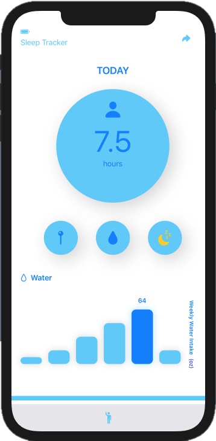

# Rich Media Production

## Reflection

```markdown

Using SwiftUI to master the art of application design and functionality, 
NMIX 4310 is a class that provides rigor and challenges creativity to 
help students develop their skills even further. <about what i learned>

```

## Projects

### _skincair_
[Project Demo](https://youtu.be/nJUcIRq1zWY) and 

<project description goes here> 
  

### _healthee_

[Project Demo](url) and 

<project description goes here>
  
