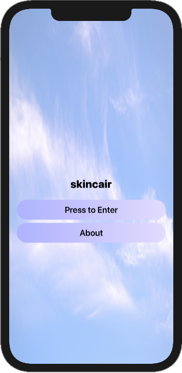
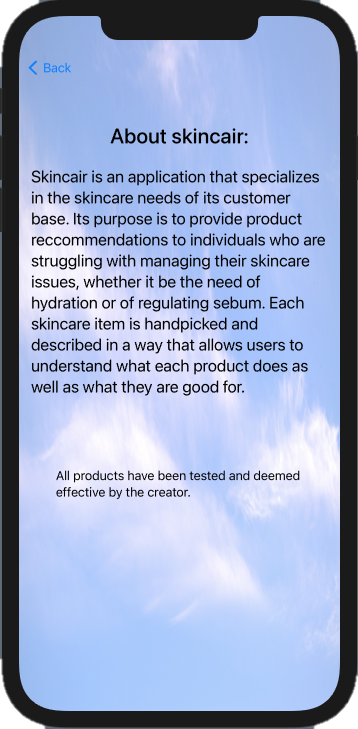
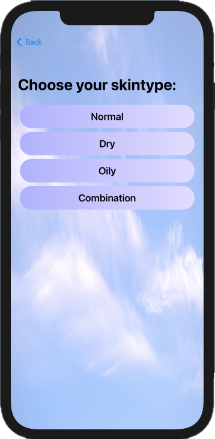
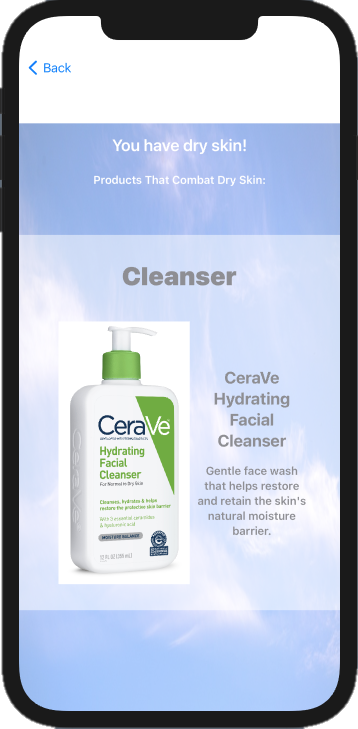
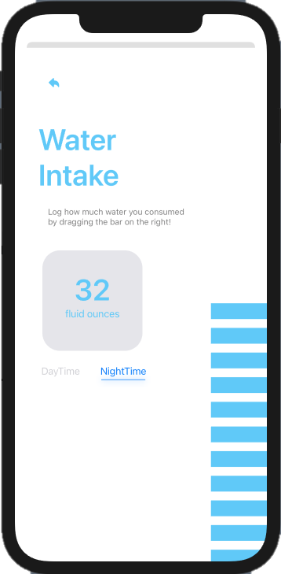

# Rich Media Production

# Reflection

```markdown

Using SwiftUI to master the art of application design and functionality, 
NMIX 4310 is a class that provides rigor and challenges creativity to 
help students develop their skills even further. <about what i learned>

```

# Projects

## _skincair_
[Project Demo](https://youtu.be/nJUcIRq1zWY)

Skincair provides skincare recommendations based on your skin type! I 
struggled with acne growing up and still do, but I know my skin is getting 
so much better that I thought I would share the products I used and the 
products that my friends used to help clear it up! In this app, the user 
encounters the home page, where they are able to click to enter the selections 
page or learn more about the purpose of the app. The selections page provides 
multiple options where you have to choose the skin type you most associate with. 
The page following the user's selection has the skincare recommendations that 
have proved to be effective by me and 3 people that I interviewed to compile 
this selection! Provided with the product images are its skincare need and 
description. The user is able to scroll through each product to read more 
about it! I hope you enjoy viewing my app and have found it helpful in some way!

### Wireframes: 

   


  

## _healthee_

[Project Demo](url) 

This app is called "Healthee". I was inspired by the FitBit app that 
helped me track how much I have walked and how much sleep that I get 
everyday. I have been getting more into health and fitness lately and 
I really wanted to use this new interest of mine as motivation to create 
an app! This health application will allow users to track their steps 
and water intake through user input. Although this app is not fully 
developed as a fitness app should be (with the technology to link it to 
an apple watch), it comprises of features that I think will be useful 
to all users. It took me a lot of time to research and learn how to 
implement these features and showcase it onto my app, so I really hope 
that you enjoy viewing this app! 


### Wireframes:

 


